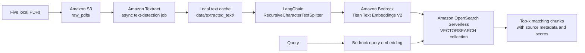

# Document Ingestion Pipeline

An AWS-based document ingestion pipeline for retrieval-augmented generation (RAG). It uploads PDF documents to Amazon S3, extracts text with Amazon Textract, splits the text into retrieval-sized chunks with LangChain, embeds those chunks with Amazon Titan Text Embeddings V2 through Amazon Bedrock, and indexes them in Amazon OpenSearch Serverless.

The included notebook also compares character chunk sizes of **200**, **500**, and **1000** while holding overlap constant at **50 characters**.

## Architecture



## Pipeline

1. `src/ingestion/s3_uploader.py` finds all PDFs in `data/raw_pdfs/`, creates or verifies the configured S3 bucket, and uploads each file under `raw_pdfs/`.
2. `src/ingestion/text_extractor.py` starts an asynchronous Textract `StartDocumentTextDetection` job for each S3 object, polls to completion, collects paginated `LINE` blocks, and writes the resulting text to `data/extracted_text/`.
3. `src/ingestion/chunking.py` uses LangChain's `RecursiveCharacterTextSplitter` to create `Document` chunks. Each chunk retains its source metadata.
4. `src/embeddings/titan_embeddings.py` configures `amazon.titan-embed-text-v2:0` through LangChain's `BedrockEmbeddings` integration.
5. `src/vectorstore/opensearch_store.py` creates an OpenSearch Serverless `VECTORSEARCH` collection, connects with AWS SigV4 authentication, and indexes the embedded chunks. The experiment stores each chunk-size condition in a separate index in the same collection.
6. `src/retrieval/retriever.py` runs top-k similarity search and returns the matched chunks with their returned scores.

## Repository Layout

```text
.
├── data/
│   ├── raw_pdfs/                  # Input PDFs; ignored by Git
│   └── extracted_text/             # Cached Textract output; ignored by Git
├── notebook/
│   └── practical_08_ingestion_pipeline.ipynb
├── src/
│   ├── embeddings/titan_embeddings.py
│   ├── ingestion/
│   │   ├── chunking.py
│   │   ├── s3_uploader.py
│   │   └── text_extractor.py
│   ├── retrieval/retriever.py
│   └── vectorstore/opensearch_store.py
├── tests/                          # Unit tests with mocked AWS dependencies
├── utils/config.py                 # Settings loaded from .env
├── test_aws.py                     # Manual AWS connectivity check
├── .env.example
└── requirements.txt
```

## Prerequisites

- Python 3.10 or newer.
- AWS CLI credentials configured for the target AWS account and region.
- Access to Amazon S3, Textract, Bedrock, and OpenSearch Serverless.
- Model access for `amazon.titan-embed-text-v2:0` in the selected Bedrock region.
- Permission to create and manage the S3 bucket and OpenSearch Serverless collection, policies, indexes, and documents used by this project.

The notebook expects these five input files in `data/raw_pdfs/`:

```text
doc_1_attention.pdf
doc_2_langchain.pdf
doc_3_aws.pdf
doc_4_bert.pdf
doc_5_rag.pdf
```

`upload_pdfs()` itself uploads every `*.pdf` file in the directory; the fixed names are used by the notebook's extraction loop.

## Setup

1. Install the dependencies.

   ```bash
   pip install -r requirements.txt
   ```

2. Configure AWS credentials if they are not already available in the environment.

   ```bash
   aws configure
   ```

3. Create the local configuration file and update the bucket name. S3 bucket names are globally unique.

   ```bash
   cp .env.example .env
   ```

4. Run the AWS smoke checks for credentials, S3, the Textract client configuration, Bedrock model metadata, and OpenSearch Serverless control-plane access.

   ```bash
   python test_aws.py
   ```

5. Start the notebook from the `notebook/` directory and run its cells in order.

   ```bash
   cd notebook
   jupyter notebook practical_08_ingestion_pipeline.ipynb
   ```

Before running the collection-creation cell, set its `PRINCIPAL_ARN` value to the IAM user or role that should receive the OpenSearch data-access policy. Obtain the current principal with:

```bash
aws sts get-caller-identity --query Arn --output text
```

## Configuration

Settings are read from `.env` by `utils/config.py`.

| Setting | Default | Purpose |
| --- | --- | --- |
| `AWS_REGION` | `us-east-1` | Region for all AWS clients. |
| `S3_BUCKET_NAME` | See `.env.example` | Bucket containing uploaded PDFs. |
| `EMBEDDING_MODEL_ID` | `amazon.titan-embed-text-v2:0` | Bedrock embedding model. |
| `OPENSEARCH_COLLECTION_NAME` | `practical8-doc-ingestion` | OpenSearch Serverless collection name. |
| `OPENSEARCH_INDEX_PREFIX` | `documents` | Prefix for experiment indexes. |
| `TEXTRACT_POLL_INTERVAL_SECONDS` | `5` | Polling interval for async Textract jobs. |
| `TEXTRACT_TIMEOUT_SECONDS` | `600` | Maximum Textract wait time per job. |
| `DEFAULT_CHUNK_OVERLAP` | `50` | Character overlap shared by adjacent chunks. |

## Chunk-Size Experiment

### Method

The notebook indexes the same extracted corpus three times:

| Condition | Index | Chunk size | Overlap |
| --- | --- | ---: | ---: |
| Small | `documents-chunk200` | 200 characters | 50 characters |
| Medium | `documents-chunk500` | 500 characters | 50 characters |
| Large | `documents-chunk1000` | 1000 characters | 50 characters |

Using one collection with three indexes avoids provisioning a separate OpenSearch Serverless collection for each condition. The embedding model, query, overlap, retrieval depth, and source text should remain unchanged; chunk size is the experimental variable.

### Recorded Notebook Results

The committed notebook contains these observed results for the query _"What is the attention mechanism in a Transformer?"_:

| Chunk size | Returned top result | Printed score | Interpretation |
| --- | --- | ---: | --- |
| 200 | A focused sentence about connecting encoder and decoder through attention | 0.5175 | The top result is narrowly relevant, but it is only a fragment of the explanation. |
| 500 | The opening passage from *Attention Is All You Need* | 0.5980 | It combines the query topic with useful surrounding context. |
| 1000 | The same opening passage as the 500-character condition | 0.5980 | No extra benefit was visible for this short sample because both sizes produced the same effective document chunk. |

For the recorded LangChain and RAG queries, every condition retrieved content from `doc_1_attention.pdf` rather than the expected topical documents. This is an incorrect retrieval result, not evidence of retrieval quality.

### Important Limitation

The executed notebook cell replaces `extracted_texts` with a short, single-document attention sample before indexing. As a result, the saved outputs indexed **three chunks for 200 characters and one chunk for 500 and 1000 characters**, all from that sample. They do **not** evaluate retrieval across the intended five-PDF corpus. The displayed scores are the scores returned by the vector store, not a normalized retrieval-quality metric.

Therefore, the saved run supports only these limited observations:

- 200-character chunks returned a more focused but less self-contained text fragment for the attention query.
- 500-character chunks returned a more useful context window for that query.
- The run cannot establish that 500 is best for the full corpus, nor compare quality for LangChain, AWS, BERT, or RAG documents.

### How To Complete the Evaluation

Restart the notebook kernel, run the Textract extraction cell for all five PDFs, and do not replace `extracted_texts` with the demonstration sample. Then evaluate each index with a fixed, labelled query set, for example:

| Query topic | Expected source |
| --- | --- |
| Transformer attention | `doc_1_attention.pdf` |
| LangChain and RAG pipelines | `doc_2_langchain.pdf` |
| AWS services | `doc_3_aws.pdf` |
| BERT architecture or pretraining | `doc_4_bert.pdf` |
| Retrieval-augmented generation | `doc_5_rag.pdf` |

For each condition, record:

- **Hit@k:** whether an expected source appears in the top `k` results.
- **MRR:** how highly the first relevant result is ranked.
- **Context sufficiency:** whether the retrieved chunk answers the query without needing an adjacent chunk.
- **Topical precision:** whether the chunk avoids unrelated material.
- **Cost and latency:** chunk count, embedding requests, index size, and retrieval latency.

Expected trade-off: 200-character chunks tend to be precise but may lack context; 1000-character chunks retain more context but can mix topics; 500 characters is a reasonable candidate to validate for balanced prose retrieval. This is a hypothesis to test against the labelled five-document corpus, not a conclusion from the current saved run.

## Tests

Run the unit suite from the project root:

```bash
pytest tests/ -v
```

These tests mock AWS-dependent behavior. They validate chunking, Textract orchestration and caching, embedding configuration, and retrieval wiring; they do not validate real AWS permissions, OCR accuracy, embeddings, OpenSearch ranking, or the experiment's retrieval metrics.

## Cost and Security Notes

- Textract processing is billed by page. Extracted text is cached locally so a repeated notebook run can reuse it.
- OpenSearch Serverless provisions billable capacity. Run the notebook cleanup cell, or call `delete_collection()`, after experimentation.
- The collection network policy in `create_collection()` allows public network access to make this learning project runnable from a laptop. Restrict access with VPC endpoints and least-privilege data policies before using this design outside an experiment.
- Keep `.env`, PDFs, extracted text, AWS credentials, and any sensitive source material out of version control. The repository ignores `.env`, `data/raw_pdfs/*.pdf`, and `data/extracted_text/*.txt`.
